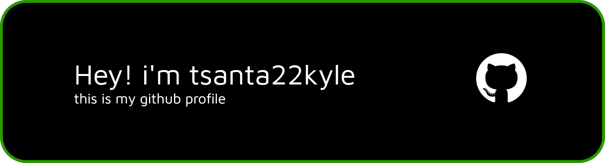

# 👋 Yo, moi c’est Tsanta Kyle

🌍 Développeur fullstack en devenir basé à Madagascar (oui, l’île là où il fait tout le temps chaud 🌞 ou pas)  
💻 Passionné de tech, UI clean, backend solide et de tout ce qui tourne autour du code propre  
📈 J'aime apprendre des nouveaux trucs, repousser mes limites et bosser sur tout type de projets qui ont du floww

---

## 🧠 À propos de moi

- 🛠️ Techs que j’utilise :  
  `JavaScript` | `TypeScript` | `React` | `Next.js` | `Node.js` | `PostgreSQL` | `Java` | `SpringBoot`

- 🔭 Toujours à fond dans l’apprentissage :
  - Performance web ⚡
  - Clean architecture 🧼
  - Git + GitHub Workflow 
  
- 🎮 Side hobbies :
  - ⚽ Foot 
  - 🎧 Muscu maison + podcasts deep
  - Jeux vidéos multi ou en solo

---

## 🎨 Portfolio

🚧 En cours de design, mais déjà accessible ici :  
🔗 [https://my-portfolio-theta-eight-61.vercel.app/](https://my-portfolio-theta-eight-61.vercel.app/)

Stay tuned... je bosse dessus quand je ne suis pas en train de refactor un form ou régler des conflits Git 💣

---

## 📊 Stats GitHub

---

## 🧩 Quelques fun facts

- 🧪 J'écrit toujours des tests même avec les projets persos
- 🧘 J’ai testé des séances de codage en musique lo-fi à 3h du mat… ça fonctionne (jusqu’à ce que VSCode plante)
- 🤖 Mon prochain défi : construire un projet fullstack solo, avec CI/CD, et me lancer sur Fiverr

---

## 📬 Comment me contacter ?

Tu veux build un projet ? Discuter tech ? Ou juste balancer une idée chelou ?  
📧 **kyle.rakotoarison@gmail.com**  
🌐 [LinkedIn](https://www.linkedin.com/in/tsantaniaina-kyle-rakotoarison-a2b511298/) 

---

> “Code like a beast, debug like a monk, deploy like a ninja 🥷 kkk”

---

<!--
tsanta22Kyle/tsanta22Kyle is a ✨ special ✨ repo because its README.md appears on your GitHub profile.
-->
